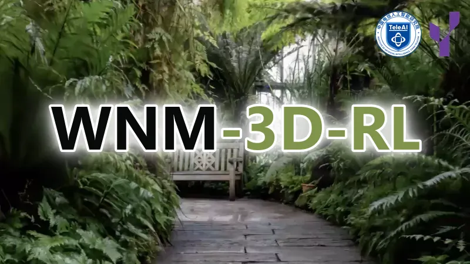

<div align="center">



<p>
  <a href="https://wnm-3d.github.io/"></a>
  <a href="https://arxiv.org/abs/2608.07267"></a>
  <a href="https://github.com/TeleHuman/WNM-3D"></a>
  <a href="https://huggingface.co/datasets/TeleEmbodied/GN-Matrix"></a>
  <a href="https://github.com/verl-project/verl-omni"></a>
  <a href="https://github.com/TeleHuman/WNM-3D/blob/master/assets/wechat.jpg"></a>
</p>

</div>

> Yuehao Huang<sup>1,2,3,†</sup>, Yunzi Wu<sup>1,2,4,†</sup>, Xiaotao Zhang<sup>1,2,5,†</sup>, Xinhai Li<sup>1,2,‡</sup>, Jiankun Dong<sup>1,2</sup>, Jiajun Lv<sup>3</sup>, Chi Zhang<sup>1,2</sup>, Chenjia Bai<sup>1,2,&#42;</sup>, Yong Liu<sup>3,&#42;</sup>, Xuelong Li<sup>1,2,&#42;</sup><br>
> <sup>1</sup> Institute of Artificial Intelligence, China Telecom &nbsp; <sup>2</sup> Gamma Robotics &nbsp; <sup>3</sup> Zhejiang University &nbsp; <sup>4</sup> Tongji University &nbsp; <sup>5</sup> Shanghai Jiao Tong University<br>
> <sup>†</sup> Equal Contributions &nbsp; <sup>‡</sup> Project Leader &nbsp; <sup>&#42;</sup> Corresponding Authors

## 🏠 Overview

WNM-3D-RL is the official Stage-III reinforcement-learning companion to
[WNM-3D](https://github.com/TeleHuman/WNM-3D). Built on
[VERL-Omni](https://github.com/verl-project/verl-omni), it provides
reward-guided post-training for WNM-3D's joint future-view and
navigation-action generator.

This repository contains the paper-aligned Counterfactual DanceGRPO recipe,
WNM-3D rollout and actor integrations, navigation rewards, GN0 data conversion,
and checkpoint export tools. Stage-I A\* supervision, Stage-II DAgger-SFT,
released checkpoints, and online inference are maintained in the main WNM-3D
repository.

> [!IMPORTANT]
> This repository does not include WNM-3D weights, training data, simulator
> assets, or the external WNM-3D model implementation. Prepare Stage-I and
> Stage-II with WNM-3D before starting Stage-III here.

WNM-3D follows a progressive three-stage training curriculum:

| Stage | Method | Training signal | Repository |
| --- | --- | --- | --- |
| I | Offline A\* SFT | Expert future views and actions | [WNM-3D](https://github.com/TeleHuman/WNM-3D) |
| II | Closed-loop DAgger-SFT | Expert corrections at policy-visited states | [WNM-3D](https://github.com/TeleHuman/WNM-3D) + [GN0](https://github.com/TeleHuman/GN0) |
| III | Counterfactual DanceGRPO | Visual, navigation, STOP, yaw, and collision rewards | **This repository** |

Stage-III starts from a complete Stage-II WNM-3D checkpoint. It samples
counterfactual future-view/action trajectories from fixed DAgger contexts and
optimizes them with decomposed GRPO advantages. The simulator is not stepped
during optimization; GN0 records provide the reference trajectory, occupancy,
goal, and event metadata used by the reward functions.

### Highlights

- **Joint world-action policy optimization.** The trainable video/action DiT is
  updated while the WNM-3D geometry encoders and other pretrained components
  remain frozen.
- **Counterfactual stratified rollout.** Each prompt uses four diffusion-noise
  strata and four counterfactual branches per stratum, with shared initial
  noise and deterministic request-level RNG.
- **Layer-conditioned credit assignment.** Visual quality, all four navigation
  chunks, and all four STOP chunks receive separately normalized GRPO
  advantages. Collision penalties and recovery shaping remain within the
  navigation reward.
- **Deployment-aligned reward design.** The official recipe combines
  distance-scaled premature-STOP penalties; path-, rate-, and
  reference-heading yaw guards; hard-collision penalties; soft clearance-risk
  shaping; and bounded collision-recovery bonuses.
- **Fail-closed release contract.** Dataset provenance, checkpoint schema,
  action normalization, topology divisibility, and algorithm constants are
  validated before Ray starts.

The sole supported recipe is `wnm-3d-stage3-navigation-grpo-r1`:

```bash
bash recipes/wnm_3d/stage3/launch.sh
```

## 📖 News

- `[2026-08-25]` We released the official Stage-III Counterfactual DanceGRPO
  training code for WNM-3D.
- `[2026-08-12]` The official [WNM-3D project website](https://wnm-3d.github.io/)
  was launched.
- `[2026-08-07]` The WNM-3D paper became available on
  [arXiv](https://arxiv.org/abs/2608.07267).

---

## 📋 Table of Contents

- [🏠 Overview](#-overview)
- [📖 News](#-news)
- [📚 Installation](#-installation)
- [🤗 Workspace and Artifacts](#-workspace-and-artifacts)
- [🗂️ Prepare Stage-III Data](#️-prepare-stage-iii-data)
- [⚙️ Configure the Recipe](#️-configure-the-recipe)
- [🚆 Launch Training](#-launch-training)
- [📦 Export a Checkpoint](#-export-a-checkpoint)
- [📁 Repository Layout](#-repository-layout)
- [🧪 Development](#-development)
- [🔗 Citation](#-citation)
- [👏 Acknowledgements](#-acknowledgements)
- [📄 License](#-license)

## 📚 Installation

WNM-3D-RL requires Linux, NVIDIA GPUs, Python 3.11 or 3.12, a CUDA-compatible
PyTorch stack, the pinned VERL revision, and the external WNM-3D checkout. The
reference CUDA image and CI use Python 3.12.

Clone WNM-3D-RL next to WNM-3D:

```bash
git clone https://github.com/TeleHuman/WNM-3D-RL.git
cd WNM-3D-RL
```

Install the rollout and training dependencies in this order inside the target
environment:

```bash
conda create -n wnm3d python=3.12 -y
conda activate wnm3d
export UV_PROJECT_ENVIRONMENT="$CONDA_PREFIX"

python -m pip install --upgrade uv

uv pip install -e ".[gpu]" --torch-backend=auto
uv pip install \
  "vllm-omni @ git+https://github.com/vllm-project/vllm-omni.git@$(cat .github/vllm_omni_pin.txt)"
uv pip install -e ".[train,wam,dev]"
MAX_JOBS=8 uv pip install --no-build-isolation -e ".[attention]"
```

`uv pip install` already discovers an activated Conda environment through
`CONDA_PREFIX`; setting `UV_PROJECT_ENVIRONMENT` additionally keeps uv project
commands such as `uv sync` and `uv run` in that same environment.

The `verl-omni` wheel contains only the `verl_omni` Python library. The
official Stage-III recipe, cluster launch scripts, and runtime contracts are
source-tree assets; run complete training from a Git checkout rather than from
an installed wheel alone.

WNM-3D is consumed from `WNM3D_SOURCE_ROOT` through `PYTHONPATH`. Do not install
the WNM-3D project dependencies into this environment: its standalone SFT and
inference environment has different Torch, Transformers, and Diffusers pins.

Verify the core imports in the same environment that will launch Ray:

```bash
python -c 'import ray, torch, pyarrow, safetensors, verl, verl_omni'
```

Alternatively, build the reference CUDA/Ray/RDMA image:

```bash
docker build -f docker/Dockerfile.cuda --target dev -t wnm-3d-rl:cu130-dev .
```

The image intentionally excludes the external WNM-3D source, model weights,
datasets, and outputs. Mount those resources at runtime.

## 🤗 Workspace and Artifacts

For end-to-end data preparation, the recommended workspace keeps the model,
RL, and benchmark repositories as siblings:

```text
workspace/
├── WNM-3D/       Stage-I/II training, model implementation, and inference
├── WNM-3D-RL/    Stage-III reinforcement learning
└── GN0/          DAgger collection and GN-Bench evaluation
```

GN0 is required only to collect or regenerate the Stage-III DAgger/reference
records. If the converted Parquet files, referenced source videos, and
occupancy assets are already available, Stage-III training itself does not
require the GN0 checkout or the GN-Bench environment.

Stage-III training requires:

- the external WNM-3D source checkout;
- a complete Stage-II WNM-3D checkpoint for policy initialization;
- the checkpoint used to define the data and action-normalization contract;
- UMT5 tokenizer and text-encoder weights;
- CLIP image-encoder weights;
- the Wan2.2 VAE;
- the VGGT-Ω checkpoint;
- Stage-III GN0 DAgger/reference records; and
- the corresponding InteriorGS occupancy assets.

Follow the main WNM-3D
[training guide](https://github.com/TeleHuman/WNM-3D/blob/master/docs/TRAINING.md)
to train Stage-I, collect DAgger records, and train Stage-II.

The initialization and data-contract checkpoints may contain different learned
weights, but their model configuration, transform metadata, and action
normalization must match exactly. The launcher verifies this contract.

## 🗂️ Prepare Stage-III Data

Collect a dedicated Stage-III DAgger/reference root with the Stage-II policy as
described by WNM-3D. Each converted sample contains 66 RGB frames: 33 history
frames followed by 33 target frames. The records also retain the reference
trajectory, goal, occupancy scene, action-normalization statistics, and event
metadata required by the rewards.

The converter stores references to the source MP4 files rather than copying
them. All training nodes must therefore resolve the same data paths.

### 1. Convert GN0 records to VERL-Omni Parquet

```bash
export GN0_COLLECTION_ROOT=/path/to/gn0-stage3-collection
export OCCUPANCY_ROOT=/path/to/interiorgs-scenes
export DATA_CONTRACT_CKPT=/path/to/wnm-3d-stage2
export CONVERTED_ROOT=/path/to/converted-stage3-data

python tools/data/convert_interiorgs_dagger_to_rlhf.py \
  --input-root "$GN0_COLLECTION_ROOT" \
  --output-dir "$CONVERTED_ROOT" \
  --checkpoint "$DATA_CONTRACT_CKPT" \
  --occupancy-root "$OCCUPANCY_ROOT" \
  --shard-size 2048 \
  --val-fraction 0 \
  --split-seed 42 \
  --workers 32 \
  --worker-prefetch 4
```

Inspect `manifest.json` and require `counts.skipped == 0`. The manifest records
the model/config hashes and the complete `action_normalization.json` contract
inherited from the selected checkpoint. A CLI scale assertion is rejected if
it differs from the checkpoint; the converter never overrides the checkpoint
normalization.

### 2. Build a deterministic training subset

Choose a row count compatible with the prompt batch for the target topology:

```bash
export TRAIN_ROOT=/path/to/stage3-training-data
export TRAIN_ROW_COUNT=<TRAIN_ROW_COUNT>

python tools/data/sample_stage3_train.py \
  --source-manifest "$CONVERTED_ROOT/manifest.json" \
  --output-dir "$TRAIN_ROOT" \
  --train-size "$TRAIN_ROW_COUNT" \
  --shard-size 2048 \
  --seed 42
```

Sampling is deterministic and keeps at most one record for each source
episode, preventing query variants of the same trajectory from crossing the
training contract.

### 3. Build event-balanced validation data

```bash
export EVENT_VAL_ROOT=/path/to/stage3-event-validation
export SAMPLES_PER_EVENT=<SAMPLES_PER_EVENT>

python tools/data/build_vggt_stage3_event_val.py \
  --input-root "$GN0_COLLECTION_ROOT" \
  --output-dir "$EVENT_VAL_ROOT" \
  --checkpoint "$DATA_CONTRACT_CKPT" \
  --exclude-parquet-dir "$TRAIN_ROOT" \
  --occupancy-root "$OCCUPANCY_ROOT" \
  --per-event "$SAMPLES_PER_EVENT" \
  --workers 32
```

The held-out set balances collision precursors, premature-STOP risk, required
STOP, and near-goal continuation while excluding training sources.

## ⚙️ Configure the Recipe

Copy the machine-local path template:

```bash
cp recipes/wnm_3d/stage3/paths.env.example \
   recipes/wnm_3d/stage3/paths.env
```

Edit `paths.env` and provide:

| Variable | Purpose |
| --- | --- |
| `WNM3D_SOURCE_ROOT` | WNM-3D source checkout |
| `WNM3D_INITIAL_CHECKPOINT` | Complete Stage-II initialization checkpoint |
| `WAM_DATA_CONTRACT_CHECKPOINT` | Checkpoint used during data conversion |
| `WNM_TOKENIZER_SOURCE` | UMT5 tokenizer directory |
| `WNM_TEXT_ENCODER_SOURCE` | Frozen UMT5 encoder weights |
| `WNM_IMAGE_ENCODER_SOURCE` | Frozen CLIP encoder weights |
| `WNM_VAE_SOURCE` | Wan2.2 VAE weights |
| `WNM_VGGT_SOURCE` | VGGT-Ω checkpoint |
| `WAM_DATA_ROOT` | Sampled Stage-III training dataset |
| `WAM_EVENT_VAL_FILE` | Event-balanced validation Parquet |
| `WAM_EXPECTED_TRAIN_SIZE` | Exact training row count from the manifest |
| `WAM_VAL_MAX_SAMPLES` | Exact validation row count to evaluate |
| `WAM_OUTPUT_DIR` | Durable output directory |

`paths.env` is ignored by Git. Do not commit machine paths, credentials,
private weights, datasets, logs, videos, or TensorBoard events.

Validate the complete data/model/topology contract before allocating the
training job:

```bash
bash recipes/wnm_3d/stage3/validate.sh
```

A valid setup prints `STAGE3_CONFIG_CONTRACT_OK`.

## 🚆 Launch Training

### Single node

The default topology is one node with eight GPUs:

```bash
bash recipes/wnm_3d/stage3/launch.sh
```

### Multiple nodes

Run the same launcher on every homogeneous node with a common head address and
a distinct zero-based rank.

Node 0:

```bash
NNODES=<NODE_COUNT> \
NODE_RANK=0 \
MASTER_ADDR=<HEAD_IPV4> \
bash recipes/wnm_3d/stage3/launch.sh
```

Each worker:

```bash
NNODES=<NODE_COUNT> \
NODE_RANK=<RANK> \
MASTER_ADDR=<HEAD_IPV4> \
bash recipes/wnm_3d/stage3/launch.sh
```

The resource resolver preserves 16 rollouts per prompt and derives prompt,
PPO, and micro-batches that satisfy exact FSDP divisibility. Positional Hydra
overrides are intentionally rejected so they cannot bypass the verified
algorithm contract.

The reference cluster uses `bond0` for Ray/Gloo/NCCL bootstrap and eight
`mlx5_*` devices for NCCL IB/RoCE traffic. Override these values in `paths.env`
when the cluster topology differs. The launcher refuses to terminate an
existing Ray runtime unless `WAM_REPLACE_EXISTING_RAY=true` is explicitly set.

Training logs, TensorBoard events, resolved configuration snapshots, and
automatic checkpoints are written below `WAM_OUTPUT_DIR`:

```bash
tensorboard --logdir "$WAM_OUTPUT_DIR" --bind_all
```

## 📦 Export a Checkpoint

VERL actor shards are not directly loadable by the WNM-3D inference server.
The exporter merges the trained joint video/action DiT into the complete
Stage-II WNM-3D checkpoint while preserving frozen encoders, the VAE,
configuration, and the complete `action_normalization.json` contract.

Run a dry-run first:

```bash
export BASE_WNM=/path/to/wnm-3d-stage2
export ACTOR_CKPT=/path/to/stage3-output/global_step_N/actor
export EXPORTED_WNM=/path/to/exported-wnm-3d-stage3

python tools/checkpoint/export_wnm_checkpoint.py \
  --base-vln "$BASE_WNM" \
  --actor-checkpoint "$ACTOR_CKPT" \
  --output-dir "$EXPORTED_WNM" \
  --dry-run
```

After checking tensor names, counts, and shapes, repeat without `--dry-run`:

```bash
python tools/checkpoint/export_wnm_checkpoint.py \
  --base-vln "$BASE_WNM" \
  --actor-checkpoint "$ACTOR_CKPT" \
  --output-dir "$EXPORTED_WNM"
```

The output directory must not already exist. Native FSDP export may require a
large local temporary disk; set `TMPDIR=/path/to/local-tmp` when needed.

For a one-off snapshot of a live FSDP run, use
`tools/checkpoint/hot_save_verl_fsdp.py`. Run its read-only preflight first and
add `--execute` only after verifying the Ray namespace, trainer PID, worker
count, and destination capacity.

## 📁 Repository Layout

```text
recipes/wnm_3d/stage3/       official Stage-III recipe and launch contract
tools/data/                   GN0 conversion and deterministic sampling
tools/checkpoint/             live FSDP snapshot and full-WNM export
verl_omni/pipelines/wnm_3d/  WNM-3D actor and rollout integration
verl_omni/pipelines/wnm_2d/  WNM-2D baseline integration
verl_omni/pipelines/wnm_shared/
                              shared WNM rollout mechanics
verl_omni/trainer/diffusion/ GRPO/PPO, replay, metrics, and layer credit
verl_omni/utils/reward_score/
                              navigation, STOP, collision, vision, and flow rewards
tests/                        CPU and standalone regression tests
docker/Dockerfile.cuda       CUDA/Ray/RDMA training image
```

## 🧪 Development

Install the development dependencies and run the retained checks:

```bash
pre-commit install
ruff check .
ruff format --check .
find recipes/wnm_3d/stage3 -type f -name '*.sh' -print0 \
  | xargs -0 -n1 bash -n
pytest -q $(find tests -type f -name '*_on_cpu.py' -print | sort)
```

Run `scripts/generate_trainer_config.sh` after changing Hydra configuration.

## 🔗 Citation

If WNM-3D or this Stage-III implementation is useful for your research, please
cite the WNM-3D paper:

```bibtex
@article{huang2026wnm_3d,
  title={WNM-3D: A World Navigation Model with 3D Scene Conditioning for Closed-Loop VLN},
  author={Huang, Yuehao and Wu, Yunzi and Zhang, Xiaotao and Li, Xinhai and Dong, Jiankun and Lv, Jiajun and Zhang, Chi and Bai, Chenjia and Liu, Yong and Li, Xuelong},
  journal={arXiv preprint arXiv:2608.07267},
  year={2026}
}
```

## 👏 Acknowledgements

WNM-3D-RL builds on several open-source projects. We thank their authors and
contributors:

- [VERL](https://github.com/verl-project/verl) and
  [VERL-Omni](https://github.com/verl-project/verl-omni) provide the
  distributed reinforcement-learning foundation.
- [DreamZero](https://github.com/dreamzero0/dreamzero) introduced the
  world-action modeling foundation used by WNM-3D.
- [Wan2.2](https://github.com/Wan-Video/Wan2.2) provides the video diffusion
  backbone and pretrained video components.
- [VGGT-Ω](https://github.com/facebookresearch/vggt-omega) provides the frozen
  geometry encoder used for 3D scene conditioning.
- [DINOv3](https://github.com/facebookresearch/dinov3) provides vision
  components incorporated through the WNM-3D geometry encoder.
- [GN0/GN-Bench](https://github.com/TeleHuman/GN0) provides DAgger collection
  and closed-loop navigation evaluation.

## 📄 License

Unless otherwise stated, source code in this repository is released under the
[Apache License 2.0](LICENSE). Third-party code, model weights, datasets, and
generated artifacts remain subject to their respective licenses and terms.

The current complete WNM-3D Stage-III runtime depends on VGGT-Ω and is limited
to the noncommercial research uses permitted by its license. Review
[THIRD_PARTY_NOTICES.md](THIRD_PARTY_NOTICES.md) before redistributing code or
model artifacts.
